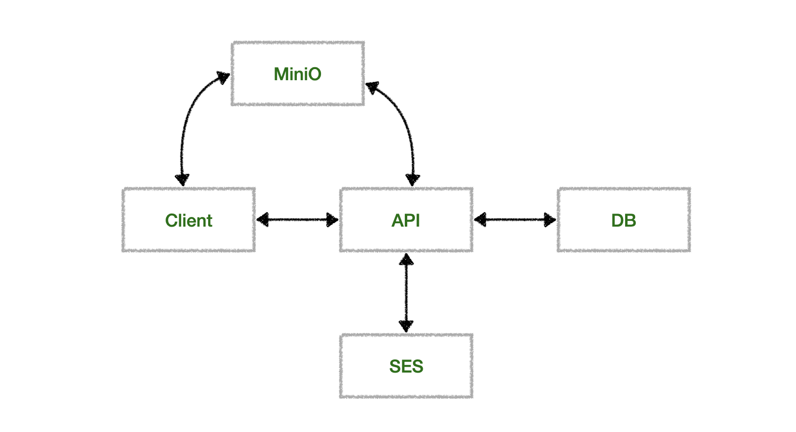

# shared-calendar
공유 캘린더 API 개발

### 아키텍처

### 버전
+ java 21
+ spring boot 3.5.4
+ minio 8.5.7
+ awssdk 2.27.21

### swagger
/swagger-ui/index.html

### 패키지 구조
모듈 확장을 고려하여 shared-calendar 안에 api 모듈을 생성하였습니다.

+ api 모듈 
    + calendar (캘린더 API)
      + api
      + app
      + domain
      + dto
      + exception (캘린더 관련 예외 처리)
      + utils (캘린더 날짜 계산 유틸)
    + common (전역 사용)
      + crypto (해싱)
      + dto
      + exception (전역 exception base)
      + id (PK id 생성 generator)
      + img (이미지 다운로드/업로드 서비스)
      + mail (초대 메일 발송 서비스)
      + security (세션 멤버 데이터)
      + validator (파라미터 유효 체크)
    + config (MiniO, SES)
    + invite (멤버 초대 API)
    + member (멤버 API)
    + security (시큐리티 관련)
    + temp (테스트용 임시 API)
    + token (jwt 인증 API)
